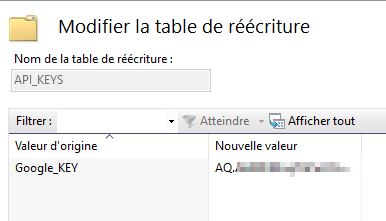
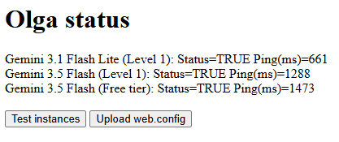

# Online LLM Generic Adapter (Olga.js)


Olga thrives to be the simplest text generator LLM adpater you can hope for and yet its unique features will make it quickly indispensable. In a word, Olga does not tell you what to do or how to do it!

What she does:
- All servers are accessed through the same common interface.
- API Keys can be manage by the web server and/or simultaneously by your application.
- Successful server requests are metered.

What she does not do:
- No pre/post processsing.
- No system/assistant/user prompt.
- No dependencies.

### To configure Olga on Windows (IIS)

- First, you will need to add the URL Rewriting features into IIS.
- Ensure olga's `web.config` file is in the same folder than your index.htm file.
- If already a `web.config`, merge it with olga's
- If not, add a `<location/>` block in your main site web.config to allow sub-sites to have their own config

```
<?xml version="1.0" encoding="UTF-8"?>
<configuration>
    <location path="." inheritInChildApplications="true" overrideMode="Allow">
        <system.webServer>
        ...
        </system.webServer>
    </location>
</configuration> 
```

### Managing API_KEYS in Windows (IIS)
- NOTE: You do not need to do this if you intend to manage your keys from the browser.
- Open the IIS Rewrite Maps section: https://learn.microsoft.com/en-us/iis/extensions/url-rewrite-module/using-rewrite-maps-in-url-rewrite-module
- Create a new `API_KEYS` map table.
- Add your provider keys to the list: Use `<provider>_KEY` syntax to match olga's web.config names.




It is possible to move the rewriteMaps section away from the `web.config` file in a separate file located in a more secure folder.

If everyting went right you should see Olga's magnificent status page



- 


## Interface

To generate new content from any available LLM

```
<script type="module">"use strict";
    import Olga from './olga.js';
    const olga = new Olga();
    olga.generate({
        prompt: "Just respond the word ok no other text", 
        doneHandler: (x) => console.log(x),
    });
</script>
```
Optional parameters:
- `chunkHandler` : Will be called each time a chunk of text is received
- `Provider` : Which provider you want to call, default = any
- `Key` : The end user API key (require Provider), default provided by IIS
- `Quality` : The minimum level of quality, default = 0
- `Temperature` : *TO BE IMPLEMENTED*

### Testing the APIs
Test the connection and streaming, not the content.
```
const olga = new Olga();
olga.test()
console.log(olga.instances) 
```

## Advanced stuff
### Managing instances
Instances are used to keep track of all interactions with the LLM servers.

It is possible to provide a handler to be called after every successfull requested.
This handler should be used to manage the instance internal statistics.
Do this only if you want to update the instance default behavior.
```
olga.setHandler( (instance) => {...} )
```
Some management strategy are provided for convenience.
The default strategy is ```Olga.CHEAPEST_FIRST```

### Adding new server API
New generator APIs and their associated plan are always welcome.

Steps to create a new API:
- Create a new API class file under ___olga/apis/___ (use any existing one as a template)
- Add the import line on top of the ___olga/olga.js___ file
- Add the related instances ```new Instance({model, plan})``` into the ```olga.initModels()``` method
- Call ```olga.downloadIIS_Config()``` to refresh the ___olga/web.config___ file

Note that each combination of model-plan is a different instance.

## Be carefull with your key management
Never write your API Keys in plain code, it could inatvertently end up on a public Github folder...


# Troubleshooting

Erreur HTTP 500.52 - URL Rewrite Module Error.
There is an error in your web.config file!

---


# Road map

Make ogla generate the IIS rules (instead of the apis)
Use provider for key names

Warning: extractIISRules poses a security risk...
Your key is safe but possible to send ad hoc requests

tell where the web.config file must be placed...


Update the olga/web.config file to include your API_KEYS (or your ALIASES)

Ce code doit [etre dans le root...]
Code d erreur: 0x80070585
Le code d'erreur 0x80070585 associé au gestionnaire ExtensionlessUrlHandler-Integrated-4.0
correspond généralement à une erreur de type "Impossible d'ajouter une entrée de collection dupliquée" (Duplicate collection entry).

ENSURE YOU HAVE THIS in your olga web.config
               </rules>
<allowedServerVariables>
    <!-- Supprime l'entrée potentiellement existante pour éviter le doublon -->
    <remove name="HTTP_Authorization" />
    <!-- Ajoute l'entrée proprement pour votre application -->
    <add name="HTTP_Authorization" />
</allowedServerVariables>
        </rewrite>